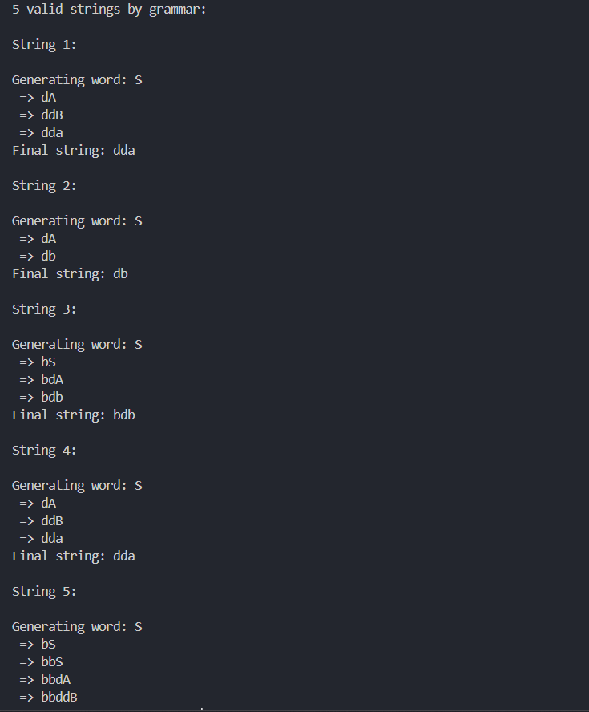
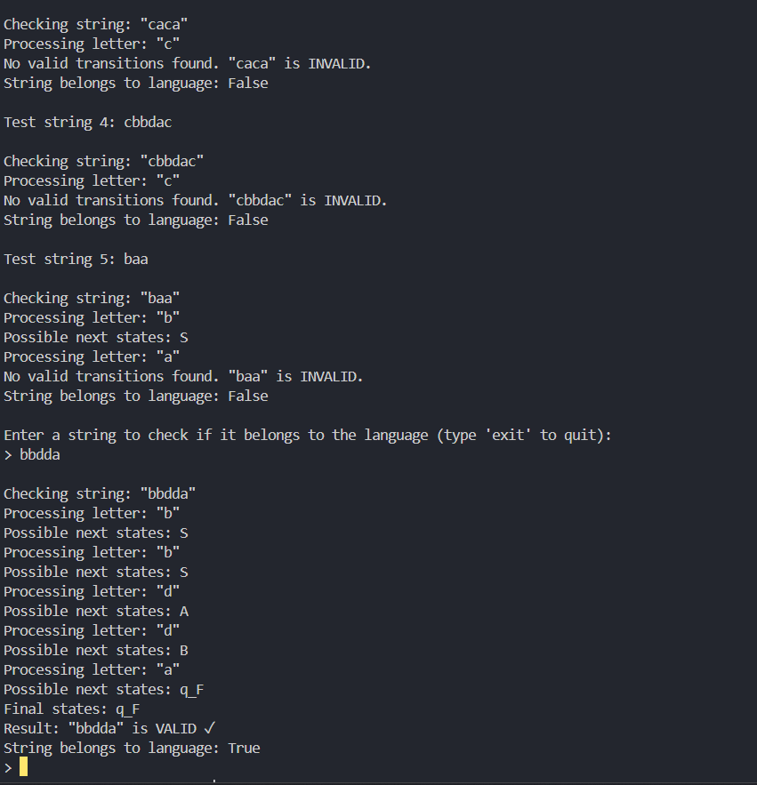

# Topic: Intro to formal languages. Regular grammars. Finite Automata.

### Course: Formal Languages & Finite Automata
### Author: Maxim Roenco

----

## Theory
A formal language can be considered to be the media or the format used to convey information from a sender entity to the one that receives it. The usual components of a language are:

- **The alphabet**: Set of valid characters
- **The vocabulary**: Set of valid words
- **The grammar**: Set of rules/constraints over the language

These components can be established in an infinite number of configurations, which means that whenever a language is being created, its components should be selected to make it as appropriate for its use case as possible. Of course, sometimes it is a matter of preference, which is why we ended up with numerous natural/programming/markup languages that might accomplish the same thing.

Formal languages are a fundamental concept in theoretical computer science, playing a crucial role in automata theory, compiler design, and natural language processing. A formal language consists of a set of strings formed from a defined alphabet and follows specific rules or grammar.

Regular grammars are a subset of formal grammars that describe regular languages. They are defined using a set of production rules that determine how strings in the language can be generated. Regular grammars can be either right-linear or left-linear, where non-terminal symbols appear either at the beginning or end of a production rule, respectively.

Finite Automata (FA) are abstract computational models used to recognize regular languages. They consist of a finite set of states, a defined alphabet, transition functions, an initial state, and one or more accepting states. There are two main types of finite automata:

- **Deterministic Finite Automaton (DFA)**: Each state has a unique transition for each symbol in the alphabet.
- **Non-Deterministic Finite Automaton (NFA)**: A state may have multiple transitions for a single input symbol, including epsilon (ε) transitions.

Finite automata are widely used in lexical analysis, pattern matching, and network protocols, making them essential for understanding formal language processing.

## Objectives:

1. Discover what a language is and what it needs to have in order to be considered a formal one.
2. Provide the initial setup for the evolving project that you will work on during this semester. You can deal with each laboratory work as a separate task or project to demonstrate your understanding of the given themes, but you also can deal with labs as stages of making your own big solution, your own project. Do the following:
    - Create GitHub repository to deal with storing and updating your project;
    - Choose a programming language. Pick one that will be easiest for dealing with your tasks, you need to learn how to solve the problem itself, not everything around the problem (like setting up the project, launching it correctly and etc.);
    - Store reports separately in a way to make verification of your work simpler;
3. According to your variant number, get the grammar definition and do the following:
    - Implement a type/class for your grammar;
    - Add one function that would generate 5 valid strings from the language expressed by your given grammar;
    - Implement some functionality that would convert an object of type Grammar to one of type Finite Automaton;
    - For the Finite Automaton, please add a method that checks if an input string can be obtained via the state transition from it;

## Implementation description

The implementation consists of a Python implementation with the following structure:

1. **Main functionality**: Entry point of the program that initializes and tests the Grammar and FiniteAutomaton classes.
2. **Grammar class**: Defines the grammar structure and generates valid words.
3. **FiniteAutomaton class**: Defines the finite automaton and checks if a string belongs to the language.

Key Parts:

### Grammar Components
```python
# The grammar is defined based on Variant 25:
vN = {"S", "A", "B"}        # Non-terminals
vT = {"a", "b", "c", "d"}        # Terminals
p = {                             # Production rules
    "S": ["bS", "dA"],
    "A": ["aA", "dB", "b"],
    "B": ["cB", "a"]
}
s = "S"                           # Start symbol
```

### String Generation by Grammar
```python
def create_word(self):
    import random
    
    word_in_progress = self.S
    print("\nGenerating word:", word_in_progress)
    
    while True:
        found_non_terminal = False
        for i, current_char in enumerate(word_in_progress):
            if current_char in self.VN:
                found_non_terminal = True
                rules = self.P.get(current_char, [])
                if not rules:
                    continue
                
                used_replacement = random.choice(rules)
                word_in_progress = word_in_progress[:i] + used_replacement + word_in_progress[i+1:]
                print(" =>", word_in_progress)
                break
        
        if not found_non_terminal:
            break
    
    return word_in_progress
```

### Grammar Conversion to FA
```python
def to_finite_automaton(self):
    q_f = {"q_F"}
    q = self.VN.union(q_f)
    sigma = self.VT.copy()
    q0 = self.S
    delta = {}
    
    for key, products in self.P.items():
        for product in products:
            terminal = product[0]
            non_terminal = product[1] if len(product) > 1 else "q_F"
            
            if terminal not in self.VT:
                continue
            
            state_transitions = delta.get(key, {})
            target_states = state_transitions.get(terminal, set())
            target_states.add(non_terminal)
            state_transitions[terminal] = target_states
            delta[key] = state_transitions
    
    return FiniteAutomaton(q, sigma, delta, q0, q_f)
```

### String Recognition
```python
def does_string_belong_to_language(self, input_string):
    current_states = {self.Q0}
    print(f"\nChecking string: \"{input_string}\"")
    
    for letter in input_string:
        print(f"Processing letter: \"{letter}\"")
        if letter not in self.Sigma:
            print(f"Invalid character \"{letter}\".")
            return False
        
        next_states = set()
        for state in current_states:
            if state in self.Delta and letter in self.Delta[state]:
                next_states.update(self.Delta[state][letter])
        
        if not next_states:
            print(f"No valid transitions found. \"{input_string}\" is INVALID.")
            return False
        
        current_states = next_states
        print(f"Possible next states: {', '.join(current_states)}")
    
    is_valid = any(state in self.QF for state in current_states)
    print(f"Final states: {', '.join(current_states)}")
    print(f"Result: \"{input_string}\" is {'VALID ✓' if is_valid else 'INVALID ✗'}")
    return is_valid
```

## Conclusions / Screenshots / Results

The implementation successfully:
1. Represents a regular grammar as defined by Variant 25
2. Generates valid strings according to the grammar
3. Converts the grammar to a finite automaton
4. Verifies whether input strings belong to the language defined by the automaton

Sample output:

```
Laboratory Work 1: Intro to formal languages. Regular grammars. Finite Automata.

Student: Roenco Maxim
Group: FAF-231
Variant 25

Grammar:
V_N = { S, A, B, C }
V_T = { a, b, c, d }
P = {
    S ---> dA
    A ---> aB | bA
    B ---> bC | aB | d
    C ---> cB
}
S = { S }


5 valid strings by grammar:

String 1:

Generating word: S
 => dA
 => daB
 => dad
Final string: dad

String 2:

Generating word: S
 => dA
 => dbA
 => dbaB
 => dbad
Final string: dbad

String 3:

Generating word: S
 => dA
 => daB
 => dabC
 => dabcB
 => dabcaB
 => dabcad
Final string: dabcad

String 4:

Generating word: S
 => dA
 => dbA
 => dbaB
 => dbabC
 => dbabcB
 => dbabcd
Final string: dbabcd

String 5:

Generating word: S
 => dA
 => daB
 => daaB
 => daaaB
 => daaaaB
 => daaaad
Final string: daaaad

Testing random strings with the Finite Automaton:

Test string 1: cbadc

Checking string: "cbadc"
Processing letter: "c"
No valid transitions found. "cbadc" is INVALID.
String belongs to language: False

Test string 2: baccd

Checking string: "baccd"
Processing letter: "b"
No valid transitions found. "baccd" is INVALID.
String belongs to language: False

Test string 3: dbad

Checking string: "dbad"
Processing letter: "d"
Possible next states: A
Processing letter: "b"
Possible next states: A
Processing letter: "a"
Possible next states: B
Processing letter: "d"
Possible next states: q_F
Final states: q_F
Result: "dbad" is VALID ✓
String belongs to language: True
```

When testing manually with valid strings like "dad", "dabcad", or invalid strings like "abc", the automaton correctly identifies whether they belong to the language or not.

## Results with Manual Testing





## References
[1] DSL_laboratory_works: Intro to formal languages. Regular grammars. Finite Automata. - Crețu Dumitru, Drumea Vasile, Cojuhari Irina - https://github.com/filpatterson/DSL_laboratory_works/blob/master/1_RegularGrammars/task.md