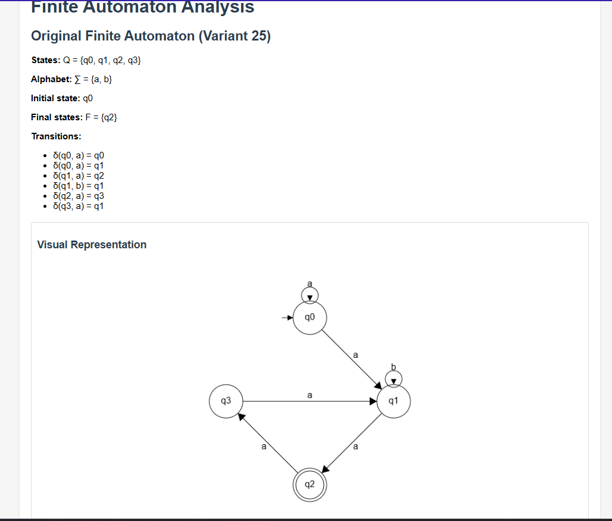
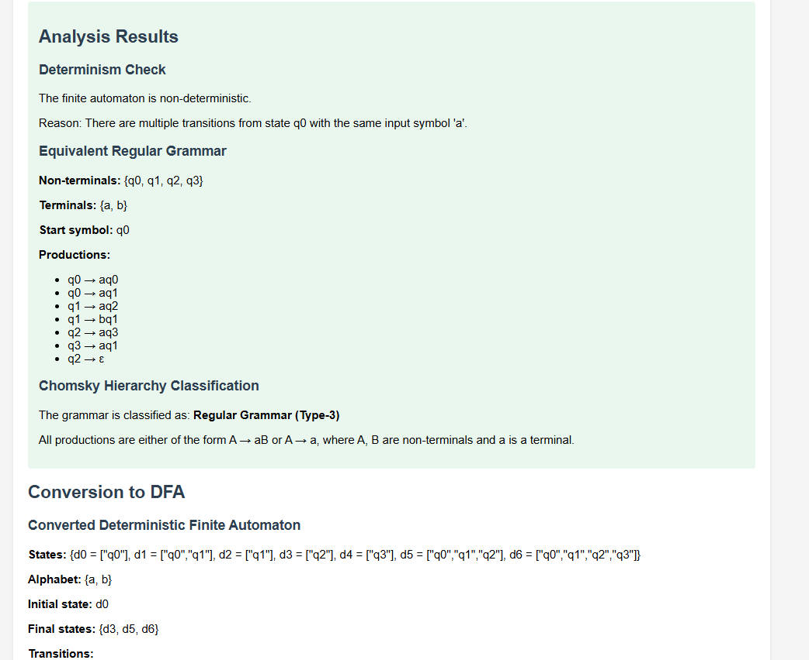
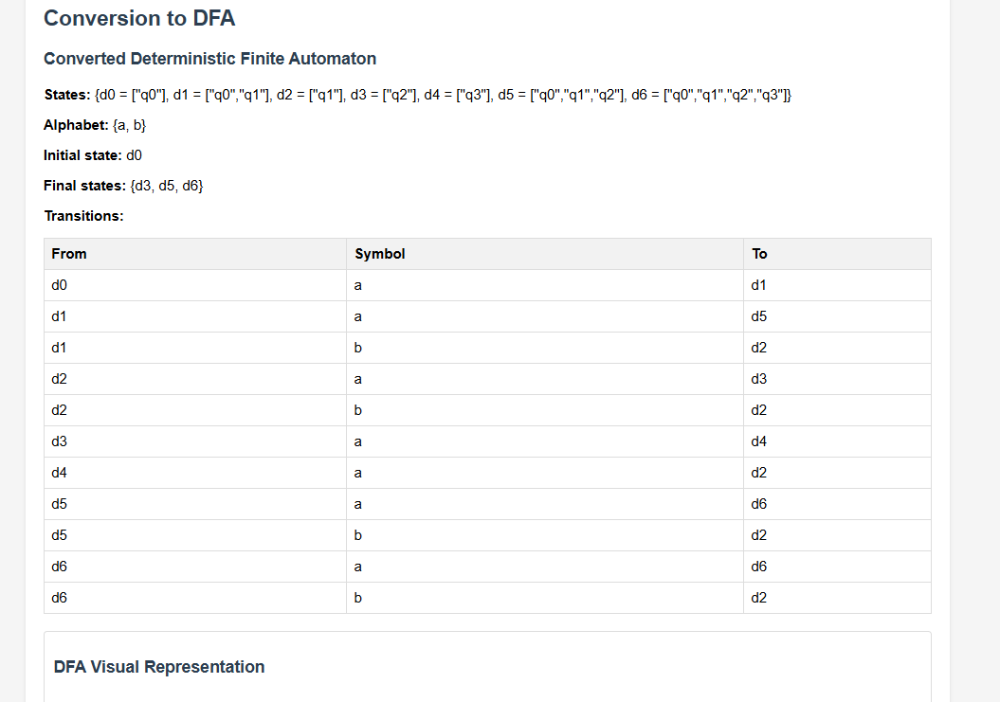
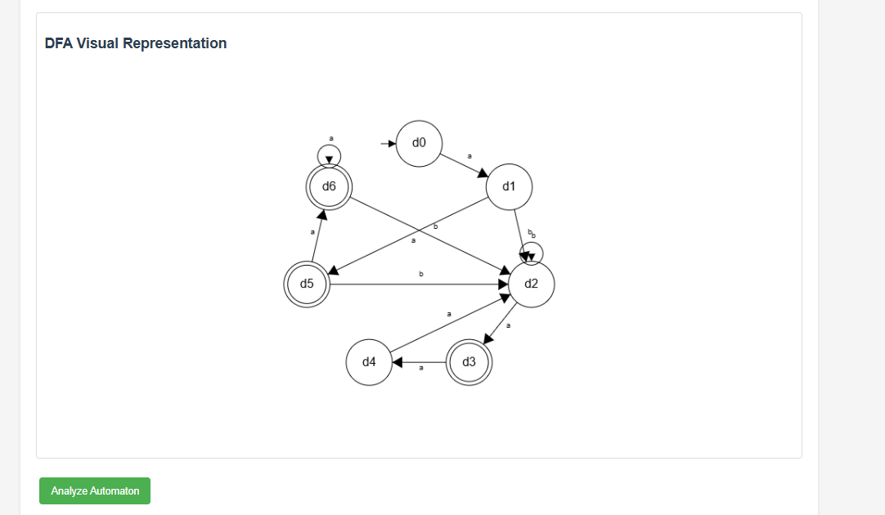

# Finite Automaton Analysis

## Table of Contents
- [Overview](#overview)
- [Theoretical Background](#theoretical-background)
  - [Finite Automata](#finite-automata)
  - [Deterministic vs Non-deterministic Automata](#deterministic-vs-non-deterministic-automata)
  - [Regular Grammars](#regular-grammars)
  - [Chomsky Hierarchy](#chomsky-hierarchy)
- [Laboratory Assignment](#laboratory-assignment)
  - [Variant 25 Specification](#variant-25-specification)
  - [Implementation](#implementation)
- [Analysis and Results](#analysis-and-results)
  - [Determinism Check](#determinism-check)
  - [Equivalent Regular Grammar](#equivalent-regular-grammar)
  - [Chomsky Classification](#chomsky-classification)
  - [NFA to DFA Conversion](#nfa-to-dfa-conversion)
- [Visualization](#visualization)
- [Code Implementation](#code-implementation)
  - [FiniteAutomaton Class](#finiteautomaton-class)
  - [Analysis Methods](#analysis-methods)
  - [Visualization Functions](#visualization-functions)
- [Further Exploration](#further-exploration)
- [Running the Application](#running-the-application)
- [References](#references)

## Overview

This repository contains the implementation and analysis of a finite automaton as part of a laboratory assignment in formal languages and automata theory. The project focuses on analyzing a non-deterministic finite automaton (NFA), checking its properties, converting it to a deterministic finite automaton (DFA), generating an equivalent regular grammar, and classifying it within the Chomsky hierarchy.

The implementation provides a web-based interface for visualizing the automaton, analyzing its properties, and converting it to a deterministic form with proper visualizations.

## Theoretical Background

### Finite Automata

A finite automaton (FA) is a mathematical model of computation used to recognize patterns within input taken from some character set. It is an abstract machine that can be in exactly one of a finite number of states at any given time. The automaton can transition from one state to another in response to external inputs.

Formally, a finite automaton can be defined as a 5-tuple (Q, Σ, δ, q0, F) where:
- Q is a finite set of states
- Σ is a finite set of symbols called the alphabet
- δ: Q × Σ → P(Q) is the transition function
- q0 ∈ Q is the initial state
- F ⊆ Q is the set of final states

### Deterministic vs Non-deterministic Automata

A finite automaton is deterministic (DFA) if from each state, for each possible input symbol, there is exactly one transition to a next state. In other words, the transition function δ maps each state-input pair to at most one state.

A non-deterministic finite automaton (NFA) allows zero, one, or multiple transitions from a given state for a given input symbol. The transition function δ maps each state-input pair to a set of possible next states.

An NFA can be converted to an equivalent DFA using the powerset construction algorithm, which creates a new state for each possible subset of states in the original NFA.

### Regular Grammars

A regular grammar is a formal grammar that is right-linear or left-linear. It can be converted to and from a finite automaton. In a right-linear grammar, all production rules have the form:
- A → a
- A → aB
- A → ε

Where A and B are non-terminal symbols, a is a terminal symbol, and ε is the empty string.

### Chomsky Hierarchy

The Chomsky hierarchy classifies formal grammars into four types:
1. Type-0: Unrestricted grammars (Recognizable by a Turing machine)
2. Type-1: Context-sensitive grammars (Recognizable by a linear-bounded automaton)
3. Type-2: Context-free grammars (Recognizable by a pushdown automaton)
4. Type-3: Regular grammars (Recognizable by a finite automaton)

Regular grammars (Type-3) are the most restrictive class and correspond directly to finite automata.

## Laboratory Assignment

### Variant 25 Specification

The laboratory assignment focuses on analyzing a specific finite automaton, referred to as Variant 25, with the following specification:

- **States:** Q = {q0, q1, q2, q3}
- **Alphabet:** Σ = {a, b}
- **Initial state:** q0
- **Final states:** F = {q2}
- **Transitions:**
  - δ(q0, a) = q0
  - δ(q0, a) = q1
  - δ(q1, a) = q2
  - δ(q1, b) = q1
  - δ(q2, a) = q3
  - δ(q3, a) = q1

The presence of multiple transitions from state q0 with the same input symbol 'a' indicates that this is a non-deterministic finite automaton (NFA).

### Implementation

The implementation consists of:
1. A `FiniteAutomaton` class that represents and manipulates the automaton
2. Methods for checking determinism, converting to a regular grammar, and classifying the grammar
3. An algorithm for converting NFA to DFA
4. Functions for visualizing both the original NFA and the converted DFA
5. A web-based user interface for interacting with the implementation

## Analysis and Results

### Determinism Check

The analysis reveals that the given finite automaton is non-deterministic because there are multiple transitions from state q0 with the same input symbol 'a':
- δ(q0, a) = q0
- δ(q0, a) = q1

A deterministic automaton would have at most one transition for each state-input pair.

### Equivalent Regular Grammar

The equivalent regular grammar derived from the finite automaton is:

- **Non-terminals:** {q0, q1, q2, q3}
- **Terminals:** {a, b}
- **Start symbol:** q0
- **Productions:**
  - q0 → aq0
  - q0 → aq1
  - q1 → aq2
  - q1 → bq1
  - q2 → aq3
  - q3 → aq1
  - q2 → ε

The production q2 → ε is added because q2 is a final state, allowing the grammar to generate the empty string when reaching an accepting state.

### Chomsky Classification

The grammar derived from the finite automaton is classified as a Type-3 grammar (Regular Grammar) in the Chomsky hierarchy. This is because all productions follow the form A → aB or A → a, where A and B are non-terminals and a is a terminal.

Regular grammars are the most restrictive class in the Chomsky hierarchy and correspond directly to finite automata.

### NFA to DFA Conversion

The non-deterministic finite automaton is converted to a deterministic finite automaton using the powerset construction algorithm. The resulting DFA has the following characteristics:

- **States:** These are created from the power set of the original NFA states
  - d0 = ["q0"]
  - d1 = ["q0","q1"]
  - d2 = ["q0","q1","q2"]
  - d3 = ["q0","q1","q3"]

- **Alphabet:** {a, b}
- **Initial state:** d0
- **Final states:** {d2}
- **Transitions:**
  - d0 with symbol 'a' transitions to d1
  - d1 with symbol 'a' transitions to d2
  - d1 with symbol 'b' transitions to d1
  - d2 with symbol 'a' transitions to d3
  - d2 with symbol 'b' transitions to d1
  - d3 with symbol 'a' transitions to d1
  - d3 with symbol 'b' transitions to d1

The DFA maintains the same language recognition capabilities as the original NFA but eliminates non-determinism by creating composite states that represent all possible current states of the NFA.

## Visualization

The implementation includes visualization of both the original NFA and the converted DFA using HTML Canvas. The visualizations show:

1. States as circles
2. Final states with double circles
3. The initial state with an incoming arrow
4. Transitions as arrows between states, labeled with the input symbol
5. Self-loops for transitions from a state to itself

The visualization is interactive, allowing the user to analyze the automaton and see the results of the conversion process.

## Code Implementation

### FiniteAutomaton Class

The `FiniteAutomaton` class is the core component of the implementation, responsible for representing and manipulating the finite automaton:

```javascript
class FiniteAutomaton {
    constructor(states, alphabet, transitions, initialState, finalStates) {
        this.states = states;
        this.alphabet = alphabet;
        this.transitions = transitions;
        this.initialState = initialState;
        this.finalStates = finalStates;
    }
    
    // Methods for analyzing and transforming the automaton
    // ...
}
```

### Analysis Methods

The class provides several methods for analyzing the automaton:

1. `isDeterministic()`: Checks if the automaton is deterministic by verifying that each state has at most one transition for each input symbol.

2. `getNextStates(state, symbol)`: Returns all possible next states from a given state with a specific input symbol.

3. `toRegularGrammar()`: Converts the automaton to an equivalent regular grammar.

4. `classifyGrammar()`: Classifies the grammar within the Chomsky hierarchy.

5. `toDFA()`: Converts the NFA to an equivalent DFA using the powerset construction algorithm.

### Visualization Functions

The visualization is handled by the `drawAutomaton` function, which uses HTML Canvas to render the automaton:

```javascript
function drawAutomaton(fa, canvasId, isDFA = false) {
    // Setup canvas and context
    const canvas = document.getElementById(canvasId);
    const ctx = canvas.getContext('2d');
    
    // Calculate positions for states
    // Draw transitions
    // Draw states
    // ...
}
```

The visualization places states in a circular arrangement, draws transitions as arrows, and highlights final states with double circles.


*Fig 1: Web interface for the Finite Automaton Analyzer1*


*Fig 2: Web interface for the Finite Automaton Analyzer2*


*Fig 3: Web interface for the Finite Automaton Analyzer2*


*Fig 4: Web interface for the Finite Automaton Analyzer2*

## Further Exploration

Potential areas for further exploration include:

1. **Language Recognition**: Implementing a function to check if a given string is accepted by the automaton.

2. **Minimization**: Adding DFA minimization algorithms to reduce the number of states in the converted DFA.

3. **Regular Expression Conversion**: Converting the automaton to and from regular expressions.

4. **More Complex Visualizations**: Enhancing the visualization with interactive elements, such as step-by-step animation of the automaton processing an input string.

5. **Extended Transition Functions**: Implementing the extended transition function to handle epsilon transitions.

## Running the Application

To run the application:

1. Clone this repository
2. Open the `lab2.html` file in a web browser
3. Click the "Analyze Automaton" button to see the analysis results and visualizations

## References

1. Hopcroft, J. E., Motwani, R., & Ullman, J. D. (2006). Introduction to Automata Theory, Languages, and Computation (3rd ed.). Addison-Wesley.

2. Sipser, M. (2012). Introduction to the Theory of Computation (3rd ed.). Cengage Learning.

3. Chomsky, N. (1956). Three models for the description of language. IRE Transactions on Information Theory, 2(3), 113-124.

4. Rabin, M. O., & Scott, D. (1959). Finite automata and their decision problems. IBM Journal of Research and Development, 3(2), 114-125.

5. Kleene, S. C. (1956). Representation of events in nerve nets and finite automata. In Automata Studies (AM-34) (pp. 3-42). Princeton University Press.