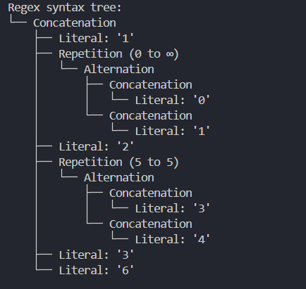

# Regular Expression Generator: Implementation and Analysis

### Course: Formal Languages & Finite Automata
### Author: Roenco Maxim

## 1. Introduction

Regular expressions are powerful pattern-matching tools in formal language theory that bridge theoretical concepts with practical applications. This report documents the implementation of a dynamic regular expression generator system that interprets regex patterns and produces valid matching strings through abstract syntax tree (AST) parsing.

### 1.1 Theoretical Background

Regular expressions define patterns that describe sets of strings forming regular languages. Their relationship to formal language theory includes:

- **Regular Grammars**: Define rules for producing regular languages
- **Finite Automata**: Provide mechanisms to recognize these languages
- **Regular Expressions**: Offer practical notation to describe patterns

The core components include:

Component | Example | Purpose
---------|----------|----------
Literal characters | `a` | Match themselves directly
Metacharacters | `*`, `+`, `?` | Special meaning in pattern matching
Character classes | `[a-z]` | Match from a defined set
Groups | `(ab)` | Bundle pattern parts

## 2. Implementation Architecture

The implementation follows a modular design with three principal components:



### 2.1 Core Data Structure: RegexNode

The `RegexNode` class forms the foundation of our AST representation:

```typescript
export class RegexNode {
  type: RegexNodeType;
  value: string = "";
  children: RegexNode[] = [];
  minRepeat: number = 0;
  maxRepeat: number = 0;

  constructor(type: RegexNodeType) {
    this.type = type;
  }
}
```

Each node has a specific type that determines its processing behavior:

Node Type | Purpose
---------|----------
Literal | Represents basic characters
Alternation | Handles choice between alternatives (using `|`)
Concatenation | Joins adjacent elements
Repetition | Manages repeating patterns (`*`, `+`, `?`, `{n,m}`)

### 2.2 Parsing Mechanism

The parser transforms regex strings into ASTs through recursive descent parsing:

```typescript
export class RegexParser {
  parseRegex(pattern: string): RegexNode {
    let position = { current: 0 };
    return this.parseExpression(pattern, position);
  }
  // Additional parsing methods...
}
```

The parsing process handles:
- Character-by-character traversal of the input pattern
- Creation of appropriate nodes based on encountered operators
- Building branched structures for alternation
- Organization of adjacent elements as children of concatenation nodes
- Configuration of repetition nodes with proper min/max values

### 2.3 Generation Logic

The generator produces strings that match the parsed pattern:

```typescript
export class RegexGenerator {
  constructor(regexParser: RegexParser, repetitionLimit: number = 5, 
              maxCombinations: number = 50) {
    this._repetitionLimit = repetitionLimit;
    this._regexParser = regexParser;
    this._maxCombinations = maxCombinations;
  }
  // Generation methods...
}
```

Key features include:
- Recursive traversal of the AST
- Type-specific handling for each node category
- Implementation of safeguards against exponential expansion
- Repetition limits to prevent infinite loops
- Maximum combination caps to control output size

### 2.4 Visualization and Analysis

The system provides tools to visualize the parsed tree structure and analyze possible combinations:

```typescript
export class RegexTreePrinter {
  static print(node: RegexNode, depth: number = 0): void {
    // Visualization logic...
  }
}
```

The analysis capabilities include:
- Tree structure visualization
- Calculation of total possible combinations
- Pattern processing explanation
- Mathematical verification of generated strings

## 3. Results and Analysis

### 3.1 Pattern 1: `(a|b)(c|d)E+G?`

The system generated 40 valid combinations, including:
- `acE`, `acEG`, `acEE`, `acEEG`, `bcE`, `bdEEEG`...

**Tree Structure:**
```
Concatenation:
  Alternation:
    Concatenation:
      Literal: 'a'
    Concatenation:
      Literal: 'b'
  Alternation:
    Concatenation:
      Literal: 'c'
    Concatenation:
      Literal: 'd'
  Repetition (1 to ∞):
    Literal: 'E'
  Repetition (0 to 1):
    Literal: 'G'
```

**Mathematical Verification:**
- `(a|b)`: 2 possibilities
- `(c|d)`: 2 possibilities
- `E+` with 5-time limit: 5 possibilities
- `G?`: 2 possibilities
- Total: 2 × 2 × 5 × 2 = 40 combinations

### 3.2 Pattern 2: `P(Q|R|S)T(UV|W|X)*Z+`

The system generated 50 combinations (maximum limit reached) out of a possible 5,460 strings.

**Selected examples:**
- `PQTZ`, `PQTZZ`, `PQTUVZ`, `PQTWZ`, `PQTUVUVZ`, `PQTWWZ`...

**Mathematical Verification:**
- `P`: 1 possibility
- `(Q|R|S)`: 3 possibilities
- `T`: 1 possibility
- `(UV|W|X)*` with 5-time limit: 364 possibilities
- `Z+` with 5-time limit: 5 possibilities
- Total: 1 × 3 × 1 × 364 × 5 = 5,460 possible combinations

### 3.3 Pattern 3: `1(0|1)*2(3|4){5}36`

The system generated 50 combinations (maximum limit reached) out of a possible 2,016 strings.

**Selected examples:**
- `123333336`, `123334436`, `124444436`, `1023333336`, `1023444436`...

**Mathematical Verification:**
- `1`: 1 possibility
- `(0|1)*` with 5-time limit: 63 possibilities
- `2`: 1 possibility
- `(3|4){5}`: 32 possibilities
- `36`: 1 possibility
- Total: 1 × 63 × 1 × 32 × 1 = 2,016 possible combinations

## 4. Technical Challenges and Solutions

### 4.1 Handling Nested Expressions
**Challenge:** Processing nested groups and correctly applying operators.  
**Solution:** Implemented recursive-descent parsing with context tracking.

### 4.2 Managing Unbounded Repetition
**Challenge:** Handling potentially infinite combinations from `*` and `+` operators.  
**Solution:** Applied configurable repetition limits (default: 5).

### 4.3 Combination Explosion
**Challenge:** Exponential growth in possible combinations.  
**Solution:** Implemented maximum combination count with result pruning.

### 4.4 Ensuring Correctness
**Challenge:** Verifying all generated strings match the original pattern.  
**Solution:** Added validation steps in the generation process.

## 5. Conclusion

This implementation demonstrates how formal language theory translates into practical tools for pattern matching. Key advantages include:

1. **Flexibility:** Processes any valid regex pattern through dynamic interpretation
2. **Educational Value:** Visualizes parsing for better understanding
3. **Verification:** Generates valid strings to confirm pattern correctness

The modular design separates parsing, generation, and visualization concerns, enhancing maintainability. The system successfully balances theoretical concepts with practical limitations by implementing bounds on repetition and total output.

This approach to regex processing highlights the power of abstract syntax trees in interpreting complex patterns and provides insights into how regular expressions map to the formal languages they represent.

## References

1. Presentation on "Formal Languages and Compiler Design" - conf. univ., dr. Irina Cojuhari
2. Presentation on "Regular Language. Finite Automata" - TUM
3. LLVM - "Kaleidoscope: Kaleidoscope Introduction and the Lexer"
4. Wikipedia - "Lexical Analysis"
5. regex101 - https://regex101.com/